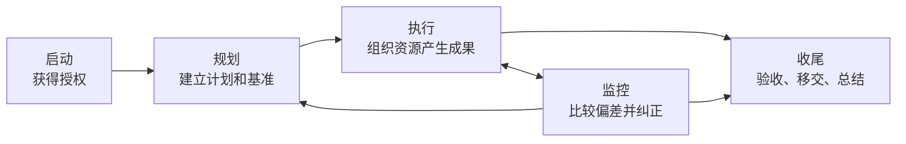
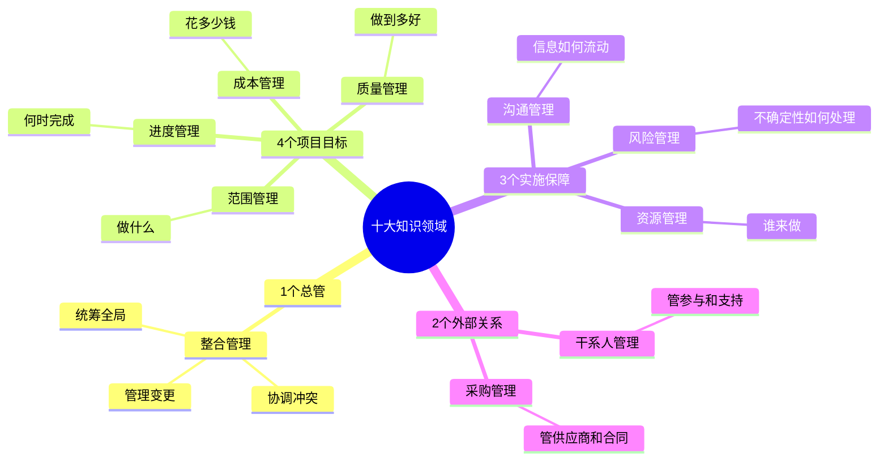

# PMI 五大过程组与十大知识领域：用一个销售看板项目建立完整知识框架

> **本文目标：**不再把“五大过程组、十大知识领域、49 个过程”当作三组孤立概念，而是通过一个统一的二维框架和销售数据看板项目，将它们连接成一张可以理解、记忆和应用的项目管理地图。


---

## 一、为什么很多人学完仍然记不住

初次学习 PMI 体系时，最常见的问题不是概念完全不懂，而是内容彼此割裂：

- 五大过程组能背出来，但不知道它们与项目阶段有什么区别；
- 十大知识领域能列出来，但不知道每个领域在项目中具体管理什么；
- 49 个过程看似熟悉，遇到情景题却无法迅速定位；
- 现实项目通常不会按照教材目录开展，导致知识无法迁移到工作场景。

根本原因是缺少一个统一的知识坐标系。

> **PMI 传统项目管理体系可以浓缩为：**<br>
> **5 个管理动作 × 10 类管理对象 = 49 个项目管理过程。**

其中：

- **五大过程组是横轴**：说明项目管理工作怎样向前推进；
- **十大知识领域是纵轴**：说明项目经理需要管理哪些对象；
- **49 个过程是横纵坐标的交叉点**：说明在某个管理阶段，对某类对象具体采取什么管理动作。

| 结构维度 | 核心问题 | 内容 |
|---|---|---|
| 五大过程组 | 项目管理工作怎么推进？ | 启动、规划、执行、监控、收尾 |
| 十大知识领域 | 项目经理需要管理什么？ | 整合、范围、进度、成本、质量、资源、沟通、风险、采购、干系人 |
| 49 个过程 | 某一领域具体做什么？ | 制定章程、收集需求、控制进度、监督风险等 |

---

## 二、五大过程组：项目管理的横向推进逻辑

五大过程组不是五个互不关联的“章节”，而是一套完整的管理闭环。



### 1. 启动过程组：批准做

启动解决的不是“详细怎么做”，而是项目是否具备正式存在的基础。

重点回答：

- 为什么要开展项目；
- 项目的高层级目标和范围是什么；
- 谁是项目经理；
- 项目经理获得什么授权；
- 谁会影响项目，谁会受到项目影响。

启动过程组只有两个过程：

1. **制定项目章程**；
2. **识别干系人**。

> **记忆理解：**先让项目合法出生，再找到所有重要相关方。

### 2. 规划过程组：计划做

规划过程组用于回答：

- 项目做什么、不做什么；
- 什么时候完成；
- 需要多少预算和资源；
- 质量达到什么标准；
- 如何沟通、采购和管理风险；
- 如何引导干系人参与。

规划的核心成果不是一份简单排期，而是：

> **项目管理计划、各类子管理计划、项目文件以及范围、进度、成本基准。**

没有规划就没有基准，没有基准也就无法判断项目是否产生偏差。

### 3. 执行过程组：真正做

执行过程组的核心是按照计划组织人员、资源和供应商，形成项目可交付成果。

典型活动包括：

- 指导项目工作；
- 获取资源并管理团队；
- 管理沟通与干系人参与；
- 管理质量；
- 实施采购；
- 实施风险应对；
- 沉淀和共享项目知识。

> **项目经理的执行职责不是亲自完成所有专业工作，而是保证正确的人，以正确的方法完成正确的工作。**

### 4. 监控过程组：盯着做

监控不是项目最后的检查，而是与执行过程持续并行。

其基本逻辑是：

> **测量实际绩效 → 与计划和基准比较 → 分析偏差 → 采取纠正、预防、缺陷补救或变更措施。**

监控重点包括：

- 范围是否失控；
- 进度是否延期；
- 成本是否超支；
- 质量是否符合要求；
- 风险是否发生变化；
- 供应商是否按合同履约；
- 干系人参与程度是否符合预期；
- 变更是否经过正式评估和批准。

### 5. 收尾过程组：正式结束

收尾并不是“团队不再干活”，而是对项目或阶段进行正式关闭。

主要工作包括：

- 获得正式验收；
- 移交产品、服务或成果；
- 关闭合同和结清事项；
- 整理项目档案；
- 总结经验教训；
- 释放项目资源；
- 发布最终报告并正式结项。

> **项目未完成正式验收、移交和经验沉淀，就不能视为真正完成。**

### 过程数量结构

| 过程组 | 过程数量 | 核心定位 |
|---|---:|---|
| 启动 | 2 | 授权项目、识别相关方 |
| 规划 | 24 | 建立完整计划和管理基准 |
| 执行 | 10 | 组织资源实施计划 |
| 监控 | 12 | 检查偏差、控制变更 |
| 收尾 | 1 | 正式关闭项目或阶段 |
| **合计** | **49** | 形成完整管理闭环 |

**数量口诀：2—24—10—12—1，共 49 个过程。**

---

## 三、十大知识领域：项目管理的纵向专业结构

十大知识领域如果平铺记忆，容易分散。更有效的方式是将其整理成：

> **1 个总管 + 4 个目标 + 3 个保障 + 2 个外联。**



### 1 个总管：整合管理

整合管理负责将项目的全部工作连接成一个整体。

它关注：

- 项目章程与整体计划；
- 各知识领域之间的协调；
- 范围、进度、成本、质量之间的权衡；
- 项目知识管理；
- 整体绩效监控；
- 变更的统一评估和审批；
- 项目或阶段的正式关闭。

> **整合管理的本质是整体权衡，而不是简单汇总材料。**

### 4 个项目目标：范围、进度、成本、质量

这四个领域共同定义项目最终要实现的核心目标。

| 知识领域 | 核心问题 | 典型关注点 |
|---|---|---|
| 范围管理 | 做什么、不做什么？ | 需求、范围边界、WBS、验收、范围蔓延 |
| 进度管理 | 什么时候完成？ | 活动、依赖关系、持续时间、关键路径、延期 |
| 成本管理 | 需要花多少钱？ | 估算、预算、成本基准、成本偏差 |
| 质量管理 | 做到什么程度？ | 标准、过程改进、检查、缺陷与验收质量 |

一句话概括：

> **做什么、何时做、花多少钱、做到多好。**

### 3 个实施保障：资源、沟通、风险

项目目标要落地，需要三个重要保障条件。

| 知识领域 | 核心问题 | 典型管理内容 |
|---|---|---|
| 资源管理 | 谁来做、用什么做？ | 人员、设备、团队建设、冲突、实物资源 |
| 沟通管理 | 信息如何正确流动？ | 沟通对象、内容、渠道、频率、反馈与存档 |
| 风险管理 | 哪些不确定性会影响项目？ | 识别、分析、应对、实施和监督风险 |

> **有合适的资源、畅通的信息和受控的不确定性，项目计划才具备可执行性。**

### 2 个外部关系：采购、干系人

项目并不是封闭系统，还需要处理外部组织和相关人员。

| 知识领域 | 核心问题 | 典型管理内容 |
|---|---|---|
| 采购管理 | 哪些工作由外部完成？ | 自制或外购、招标、合同、供应商绩效 |
| 干系人管理 | 谁影响项目，如何获得支持？ | 识别、分析、参与计划、管理和监督参与 |

**十大知识领域口诀：整范进成质，资沟风采干。**

---

## 四、五大过程组与十大知识领域如何交叉

过程组和知识领域不是两套平行知识，而是一张二维矩阵。

| 知识领域 | 启动 | 规划 | 执行 | 监控 | 收尾 | 合计 |
|---|---:|---:|---:|---:|---:|---:|
| 整合 | 1 | 1 | 2 | 2 | 1 | 7 |
| 范围 | 0 | 4 | 0 | 2 | 0 | 6 |
| 进度 | 0 | 5 | 0 | 1 | 0 | 6 |
| 成本 | 0 | 3 | 0 | 1 | 0 | 4 |
| 质量 | 0 | 1 | 1 | 1 | 0 | 3 |
| 资源 | 0 | 2 | 3 | 1 | 0 | 6 |
| 沟通 | 0 | 1 | 1 | 1 | 0 | 3 |
| 风险 | 0 | 5 | 1 | 1 | 0 | 7 |
| 采购 | 0 | 1 | 1 | 1 | 0 | 3 |
| 干系人 | 1 | 1 | 1 | 1 | 0 | 4 |
| **合计** | **2** | **24** | **10** | **12** | **1** | **49** |

从矩阵中可以发现四个重要规律。

### 规律一：启动只有整合与干系人

项目开始时首先需要：

1. 通过项目章程获得正式授权；
2. 找到可能影响项目和受到项目影响的人。

所以启动只有：

- 制定项目章程；
- 识别干系人。

### 规律二：规划覆盖全部知识领域

所有知识领域都必须提前考虑和规划，因此规划过程数量最多。

这反映出 PMI 的重要理念：

> **先计划，再行动；先建立基准，再评价实际表现。**

### 规律三：范围、进度、成本主要集中于规划和监控

这三个领域主要负责：

- 在规划阶段建立范围、进度和成本基准；
- 在监控阶段比较实际结果与基准之间的偏差。

它们虽然没有独立的执行过程，但执行团队产生的工作绩效数据会成为控制范围、控制进度和控制成本的依据。

### 规律四：收尾只属于整合管理

项目收尾需要对成果、合同、经验、资料和资源进行整体关闭，因此由整合管理统一完成。

---

## 五、用销售数据看板项目串联整套知识

下面用一个真实感更强的销售数据看板项目，将五大过程组与十大知识领域放入同一个场景。

### 场景背景

企业希望建设一套销售数据看板，为销售管理层提供收入、订单、回款、库存和区域业绩分析。项目需要协调销售、财务、产品、数据开发、BI 前端、测试、运维和管理层等多个团队。

---

### 1. 启动：确认项目为什么做、由谁负责

**整合管理：**

- 明确项目目标和高层级范围；
- 任命项目经理；
- 制定并批准项目章程；
- 明确项目成功标准和初步里程碑。

**干系人管理：**

- 识别销售负责人、财务、产品、数据团队、管理层和最终用户；
- 初步分析各方权力、利益和支持程度。

> **启动阶段重点不是讨论全部指标细节，而是让项目获得授权，并找到必须参与的人。**

---

### 2. 规划：十大知识领域全面展开

| 知识领域 | 销售看板项目中的规划内容 |
|---|---|
| 整合 | 汇总各类子计划，形成完整项目管理计划 |
| 范围 | 确认指标、口径、报表页面、数据范围和不包含内容 |
| 进度 | 安排需求澄清、数据建模、开发、联调、测试和上线时间 |
| 成本 | 估算人力、服务器、BI 工具和外部服务费用 |
| 质量 | 定义数据准确率、刷新频率、查询性能和页面展示标准 |
| 资源 | 明确产品、数据开发、前端、测试和运维人员分工 |
| 沟通 | 规定周会、周报、问题反馈和升级机制 |
| 风险 | 识别指标口径冲突、源数据延期、需求频繁变化等风险 |
| 采购 | 决定是否采购 BI 平台、咨询服务或外包开发 |
| 干系人 | 制定业务负责人参与、评审和验收机制 |

其中，范围规划可以进一步形成：

```text
销售数据看板
├── 需求与指标体系
│   ├── 销售额
│   ├── 订单量
│   ├── 回款率
│   └── 区域与产品分析
├── 数据建设
│   ├── 数据接入
│   ├── 数据清洗
│   ├── 指标模型
│   └── 数据校验
├── 看板建设
│   ├── 总览页
│   ├── 区域分析页
│   ├── 产品分析页
│   └── 明细查询页
└── 测试与上线
    ├── 数据测试
    ├── 页面测试
    ├── 用户验收
    └── 上线移交
```

这就是将项目总体范围进一步分解为可管理工作包的 WBS 思维。

---

### 3. 执行：组织资源，把计划转化为成果

进入执行阶段后，团队开始真正产出可交付成果：

- 组织需求评审，确认指标定义和业务规则；
- 完成数据接入、数据建模和 ETL 开发；
- 完成 BI 页面设计、开发和联调；
- 获取所需人员和技术资源；
- 建设团队、解决冲突并管理绩效；
- 按沟通计划向业务和管理层同步进展；
- 执行已规划的风险应对措施；
- 管理供应商或 BI 工具服务方；
- 记录技术方案、指标口径和问题处理经验。

> **执行过程的直接结果是可交付成果，同时还会产生工作绩效数据、问题日志、变更请求和经验教训。**

---

### 4. 监控：把实际结果与计划基准比较

项目经理需要持续检查：

- 新增指标是否超出原范围；
- 开发和测试是否按计划完成；
- 人力和工具费用是否超出预算；
- 数据准确率、刷新时效和页面性能是否达标；
- 风险是否发生，是否出现新的风险；
- 供应商是否按合同交付；
- 业务负责人是否按计划参与评审和验收。

例如，业务方临时要求增加一个“客户利润分析”页面，正确做法不是立即安排开发，而是：

1. 记录变更请求；
2. 分析对范围、进度、成本、质量、资源和风险的影响；
3. 提交变更控制流程；
4. 获得批准后更新相关计划和基准；
5. 通知相关干系人并组织实施。

> **PMI 并不排斥变更，而是反对未经评估和批准的无序变更。**

---

### 5. 收尾：正式验收、移交和沉淀

销售看板开发完成后，还需要：

- 由业务负责人正式验收；
- 移交运维文档、指标口径和使用手册；
- 关闭外部采购合同并结清费用；
- 归档需求、设计、测试和验收资料；
- 总结口径确认、跨部门协同和质量控制经验；
- 释放项目资源；
- 编制最终报告并正式结项。

如果只是将看板发布上线，却没有完成验收、移交和资料归档，项目仍然没有完整收尾。

---

## 六、49 个过程的主干动词链

记忆 49 个过程时，不建议从完整名称逐字硬背，而应先记住每个领域的动作逻辑。

| 知识领域 | 主干动词链 | 逻辑说明 |
|---|---|---|
| 整合 | 章、计、导、知、监、变、收 | 授权—计划—执行—知识—监控—变更—收尾 |
| 范围 | 规、集、定、分、验、控 | 规划—收需求—定边界—建WBS—验收—控制 |
| 进度 | 规、定、排、估、制、控 | 规划—定活动—排顺序—估时间—制计划—控制 |
| 成本 | 规、估、预、控 | 规划—估算—预算—控制 |
| 质量 | 规、管、控 | 定标准—改过程—查结果 |
| 资源 | 规、估、获、建、管、控 | 规划—估资源—获取—建设团队—管理团队—控制资源 |
| 沟通 | 规、管、监 | 规划沟通—传递信息—检查效果 |
| 风险 | 规、识、定、量、应、实、监 | 规划—识别—定性—定量—应对—实施—监督 |
| 采购 | 规、实、控 | 规划采购—选择供应商—控制合同 |
| 干系人 | 识、规、管、监 | 找到人—制定策略—引导参与—监督变化 |

需要特别区分：

- **确认范围**：由客户或发起人正式验收已经完成的可交付成果；
- **控制质量**：由项目团队检查成果是否符合质量要求；
- **管理质量**：关注过程是否合理，强调质量保证和过程改进。

---

## 七、PMP 情景题的四步定位法

面对情景题时，可以使用“对象—动作—过程—下一步”的定位方式。

### 第一步：判断管理对象

| 题目关键词 | 对应知识领域 |
|---|---|
| 新增功能、需求遗漏、范围蔓延 | 范围 |
| 延期、关键路径、活动依赖 | 进度 |
| 超支、预算、挣值 | 成本 |
| 缺陷、测试、质量标准 | 质量 |
| 团队冲突、人员能力、设备 | 资源 |
| 信息遗漏、汇报、会议 | 沟通 |
| 尚未发生的不确定事件 | 风险 |
| 合同、招标、供应商 | 采购 |
| 抵制、支持、参与度 | 干系人 |
| 多领域权衡、整体变更 | 整合 |

### 第二步：判断当前动作

- 正在授权项目：**启动**；
- 正在制定规则和基准：**规划**；
- 正在组织人员完成工作：**执行**；
- 正在比较实际与计划：**监控**；
- 正在验收、移交或关闭：**收尾**。

### 第三步：定位矩阵交叉点

例如：

> 项目经理发现实际完成进度比计划落后。

- 管理对象：进度；
- 管理动作：比较实际与计划；
- 对应过程：**控制进度**。

再例如：

> 一名高权力干系人从支持项目转为抵制项目。

- 管理对象：干系人；
- 管理动作：观察参与程度变化；
- 对应过程：**监督干系人参与**。

### 第四步：选择符合 PMI 思维的下一步

PMI 情景题通常强调：

> **先确认事实和分析原因，再评估影响；按既定流程处理，最后更新计划和文件。**

因此通常不应：

- 未分析原因就立即采取激烈措施；
- 绕过变更流程直接实施新增需求；
- 一遇到冲突就升级给高层；
- 未沟通就替换团队成员；
- 未经正式验收就宣布项目完成。

---

## 八、最适合快速记忆的完整框架

### 五大过程组

> **启、规、执、监、收：授权、计划、实施、纠偏、关闭。**

### 十大知识领域

> **整范进成质，资沟风采干。**

### 分类结构

> **一总、四目、三保、两外联。**

- 一总：整合；
- 四目：范围、进度、成本、质量；
- 三保：资源、沟通、风险；
- 两外联：采购、干系人。

### 数量结构

> **启动 2，规划 24；执行 10，监控 12；收尾 1，共 49。**

### 最终理解

> **横向看五大过程组，理解项目管理怎么推进；纵向看十大知识领域，理解项目经理需要管理什么；再用真实项目场景，把49个过程连接成一套管理闭环。**

---

## 九、结语

PMI 体系真正有价值的地方，不是要求项目经理机械执行 49 个步骤，而是提供一套系统化思维：

1. 项目首先需要获得正式授权；
2. 开始执行前必须建立计划和基准；
3. 项目经理要通过团队和资源形成成果；
4. 执行过程中持续比较实际与计划；
5. 面对变化时进行整体影响分析和正式变更控制；
6. 最终完成验收、移交、知识沉淀和正式关闭。

当你能够把销售数据看板、软件开发、工程建设或业务改造项目都放进这个框架时，五大过程组和十大知识领域就不再是需要死记硬背的考试内容，而会成为一套可以真正应用于项目管理实践的思考工具。
