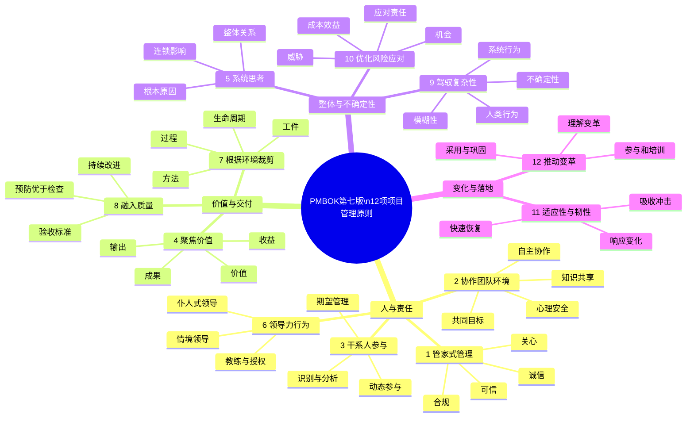

# PMBOK® 第七版项目管理12项原则：从过程执行到价值交付

> **核心结论：**PMBOK®第七版的12项原则不是12个依次执行的流程，而是一套贯穿项目全过程的**价值观、判断标准与行为准则**。它们帮助项目经理在不同生命周期、不同组织环境和不同复杂程度下，做出符合价值、治理、团队和风险要求的决策。


---

## 一、为什么PMBOK第七版从“过程”转向“原则”

PMBOK第六版以**五大过程组、十大知识领域和49个过程**为主要知识框架，重点回答：

> 项目管理通常要执行哪些过程？每个过程有哪些输入、工具技术和输出？

PMBOK第七版则进一步回答：

> 当项目环境不同、需求快速变化、组织结构复杂或无法机械套用固定流程时，项目管理者应依据什么作出判断？

因此，第七版没有否定过程管理，而是把项目管理提升到了三个更高层次：

1. **从交付范围转向交付价值**；
2. **从遵循固定流程转向根据情境裁剪方法**；
3. **从项目经理单点控制转向团队、干系人与组织系统协同**。

可以用下面的逻辑理解：

```text
原则：告诉我们“应坚持什么”
  ↓
绩效域：告诉我们“哪些领域必须持续关注”
  ↓
模型、方法和工件：告诉我们“可以使用什么手段”
  ↓
裁剪：决定当前项目“具体怎么做”
```

> **记忆重点：**原则不是步骤，绩效域不是阶段，裁剪也不是删减流程。三者共同服务于项目价值交付。

---

## 二、12项原则的整体知识框架

为了便于理解，可以将12项原则归纳为四组。该分组是学习框架，不是PMI规定的官方分类。

| 管理主题 | 所包含原则 | 解决的核心问题 |
|---|---|---|
| 人与责任 | 管家式管理、协作团队环境、干系人参与、领导力行为 | 应以什么态度管理资源，如何影响人并形成协作 |
| 价值与交付 | 聚焦价值、根据环境裁剪、将质量融入过程和成果 | 为什么做、采用什么方法做、怎样确保成果真正可用 |
| 整体与不确定性 | 系统思考、驾驭复杂性、优化风险应对 | 如何理解整体关系并处理不确定、模糊和连锁影响 |
| 变化与落地 | 适应性与韧性、推动变革 | 环境变化后如何调整，以及如何让项目成果真正被采用 |


12项原则不是彼此孤立的。例如：

- 只有**聚焦价值**，才能判断应如何**裁剪**项目方法；
- 只有理解**系统交互和复杂性**，才能制定有效的**风险应对**；
- 只有做好**干系人参与**和**领导力**，才能真正**推动变革**；
- 只有把**质量融入过程**，项目价值才可能持续实现。

---

# 三、12项项目管理原则详解

## 原则1：成为勤勉、尊重和关心他人的管家

### 1. 核心定义

项目从业者应以**诚信、关心、可信和合规**的方式管理项目，并关注项目对组织、社会、经济与环境造成的影响。

“管家式管理”意味着：项目经理并不是资源的所有者，而是受组织、客户和其他干系人委托，临时管理资金、人员、数据、设备、知识产权和组织声誉。

### 2. 管理含义

管家式管理主要包括四个方面：

- **诚信：**如实反映项目状态，不隐瞒延期、缺陷、风险和成本超支；
- **关心：**关注团队成员、客户、用户和社会公众的合理权益；
- **可信：**言行一致、履行承诺、妥善管理敏感信息；
- **合规：**遵守法律法规、合同条款、治理要求和职业道德。

### 3. 典型实践

- 项目出现重大偏差时，及时提交真实、完整的状态报告；
- 发现利益冲突、数据造假或供应商不当行为时，按治理机制处理；
- 保护客户数据、商业秘密和知识产权；
- 评估项目对环境、安全、员工健康和社会责任的影响；
- 不以赶进度为由长期透支团队。

### 4. 常见误区

- 认为“对领导负责”等同于隐瞒问题；
- 为保护团队而掩盖质量缺陷；
- 认为只要项目按时完成，伦理和社会影响可以忽略；
- 把组织资源视为项目经理可自由支配的个人资源。

### 5. PMP题目识别点

题目中出现以下情境，通常优先考虑该原则：

> 数据造假、利益冲突、违规操作、隐瞒延期、商业机密、环境影响、人员安全、供应商送礼。

**判断倾向：真实、透明、合规、保护公共利益，并按治理机制行动。**

---

## 原则2：营造协作的项目团队环境

### 1. 核心定义

项目团队应在共同目标、明确责任、相互尊重和开放沟通的环境中开展协作，使团队整体能力超过成员能力的简单相加。

### 2. 管理含义

“人员被分配到同一个项目”并不等于“已经形成团队”。高绩效项目团队通常具备：

- 共同目标与共同责任；
- 清晰的角色和工作边界；
- 心理安全和开放表达；
- 跨职能协作和知识共享；
- 适度授权与自主决策；
- 对冲突进行建设性处理。

### 3. 典型实践

- 与团队共同建立团队章程、工作协议和决策规则；
- 鼓励成员表达不同意见，而不是压制分歧；
- 通过教练、辅导和复盘提升团队能力；
- 建立信息透明机制，例如任务板、风险看板和共享工作区；
- 让最接近工作的人参与估算和决策；
- 认可团队整体贡献，而非只奖励个人英雄行为。

### 4. 常见误区

- 团队一有冲突，项目经理立即利用职位权力裁决；
- 将所有工作细节都集中到项目经理审批；
- 认为团队协作等于所有事情都必须全员一致；
- 用频繁会议代替真正的信息共享和协作。

### 5. PMP题目识别点

> 团队冲突、士气低落、职责不清、缺乏信任、信息孤岛、成员不愿发言、自组织团队。

**判断倾向：先促进沟通和协作，分析冲突原因，建立规则与信任，而不是立即处罚或升级。**

---

## 原则3：有效地干系人参与

### 1. 核心定义

项目团队应主动识别干系人，理解其需求、利益、影响力和态度，并采取适当方式促进其参与，以提高项目成功和价值实现的可能性。

### 2. 参与不等于通知

干系人参与不是简单发送周报，而是让关键干系人在适当时间参与：

- 需求澄清；
- 优先级确定；
- 方案评审；
- 风险决策；
- 验收确认；
- 组织变革和成果采用。

### 3. 干系人参与闭环

```text
识别干系人
  ↓
分析权力、利益、影响与态度
  ↓
评估当前参与程度
  ↓
确定期望参与程度
  ↓
设计沟通和参与策略
  ↓
持续监测并动态调整
```

### 4. 典型实践

- 区分支持者、中立者、抵制者和关键决策者；
- 根据权力和利益水平安排不同沟通频率；
- 让最终用户尽早参与原型评审和增量验收；
- 对反对意见先理解其原因，而不是直接说服；
- 项目环境、组织结构或干系人变化时及时更新分析。

### 5. 常见误区

- 认为所有干系人参与程度越高越好；
- 只关注发起人和高层，忽略最终用户；
- 发现干系人反对就立即升级；
- 在项目收尾时才让用户参与验收。

### 6. PMP题目识别点

> 干系人反对、需求频繁变更、用户不满意、发起人参与不足、不同部门利益冲突。

**判断倾向：先直接沟通、分析需求与态度，再更新参与策略。**

---

## 原则4：聚焦于价值

### 1. 核心定义

项目团队应持续评估项目工作、可交付成果和组织战略之间的关系，确保项目始终面向预期价值，而不是只完成计划中的活动。

### 2. 价值交付链


项目管理中需要区分四个层次：

| 层次 | 含义 | 数据看板项目示例 |
|---|---|---|
| 输出 Output | 项目交付的产品、服务或成果 | 上线销售数据看板 |
| 成果 Outcome | 输出带来的能力或行为变化 | 管理者能够实时查看销售数据 |
| 收益 Benefit | 成果带来的可衡量改善 | 报表制作时间降低、决策速度提升 |
| 价值 Value | 收益对战略和组织目标的综合贡献 | 降低运营成本、提高销售转化率 |

> **关键认知：**按时交付系统不等于实现价值。系统必须被采用、持续运行并改善业务，价值才真正形成。

### 3. 典型实践

- 在项目启动时明确业务论证、收益目标和成功标准；
- 将需求和待办事项与业务价值关联；
- 优先交付高价值、可验证的成果；
- 定期确认项目是否仍与组织战略一致；
- 对低价值功能进行推迟、调整或取消；
- 同时关注财务价值和非财务价值。

### 4. 常见误区

- 把完成范围等同于项目成功；
- 只关注产出数量，不关注采用率和业务结果；
- 为维护原计划而继续开发已失去价值的功能；
- 认为价值只能在项目结束后衡量。

### 5. PMP题目识别点

> 商业论证变化、产品无人使用、项目目标与战略不一致、优先级冲突、最小可行产品、收益实现。

**判断倾向：回到价值和业务目标，重新评估优先级与项目合理性。**

---

## 原则5：识别、评估和响应系统交互

### 1. 核心定义

项目是组织和外部环境中的一个开放系统。项目团队应理解项目各组成部分之间，以及项目与组织、客户、供应商、市场、技术和法规之间的相互作用。

### 2. 系统思考的重点

系统思考要求项目经理：

- 不只看单个问题，还要看问题之间的关联；
- 不只解决表面症状，还要分析根本原因；
- 不只优化局部绩效，还要评估对整体目标的影响；
- 不只考虑直接影响，还要考虑延迟影响和连锁反应。

例如，为赶进度而压缩测试：

```text
压缩测试时间
  ↓
短期进度看似改善
  ↓
缺陷遗漏增加
  ↓
返工、投诉和维护成本增加
  ↓
项目整体进度和价值反而下降
```

### 3. 典型实践

- 进行根本原因分析、影响分析和依赖分析；
- 从项目集、项目组合和组织战略层面理解项目；
- 识别技术、流程、人员和供应商之间的接口；
- 评估变更对范围、进度、成本、质量、风险和价值的综合影响；
- 避免只优化单个部门或单个绩效指标。

### 4. 常见误区

- 只看局部指标，不看整体结果；
- 认为项目边界之外的因素不属于项目经理关注范围；
- 将复杂问题归因于单一人员或单一原因；
- 变更一项内容时不进行综合影响分析。

### 5. PMP题目识别点

> 多系统接口、跨部门依赖、变更产生连锁影响、局部优化、重复发生的问题、组织级约束。

**判断倾向：先分析整体关联和根本原因，再决定解决方案。**

---

## 原则6：展现领导力行为

### 1. 核心定义

项目从业者应根据团队、个人和项目环境的需要展现领导力。领导力来自影响和行动，不仅来自职位和正式权力。

### 2. 管理与领导的区别

| 项目管理行为 | 项目领导行为 |
|---|---|
| 制定计划、组织资源、监控偏差 | 建立愿景、激励成员、影响行为 |
| 强调结构、秩序和可预测性 | 强调方向、协作和适应变化 |
| 依赖职责和正式权限 | 依赖信任、专业能力和影响力 |
| 解决“如何执行” | 回答“为什么做、向哪里前进” |

两者并非互相替代。优秀项目经理既要进行管理，也要展现领导力。

### 3. 情境化领导

- 新团队或能力不足：更多指导、培训和教练；
- 成熟团队：更多授权、支持和障碍清除；
- 紧急危机：短期可采用明确指挥；
- 创新项目：鼓励试验、质疑与学习；
- 敏捷团队：更多采用仆人式领导。

### 4. 典型实践

- 建立共同愿景并说明工作意义；
- 依据成员成熟度调整领导风格；
- 通过倾听、同理心和情绪管理处理冲突；
- 授权团队决策，并为团队清除障碍；
- 对成员进行教练、辅导和反馈；
- 在压力环境下保持诚信与稳定。

### 5. 常见误区

- 将领导力等同于命令和控制；
- 所有情境使用同一种领导风格；
- 敏捷环境中完全放弃管理责任；
- 授权后不再提供支持和边界。

### 6. PMP题目识别点

> 授权、激励、教练、辅导、冲突、情商、仆人式领导、团队成熟度、愿景。

---

## 原则7：根据环境进行裁剪

### 1. 核心定义

项目团队应根据项目目标、规模、复杂性、治理要求、干系人、组织文化和不确定性，对生命周期、方法、过程、工具和工件进行适配。

### 2. 裁剪的对象

- **生命周期：**预测型、迭代型、增量型、敏捷型或混合型；
- **过程：**风险、变更、质量、采购和沟通管理的正式程度；
- **方法：**WBS、看板、用户故事、滚动式规划、原型等；
- **工件：**计划、登记册、报告、基准、待办事项列表；
- **治理：**审批层级、控制阈值、审计和合规要求。

### 3. 裁剪的判断逻辑

```text
组织治理和合规约束
        +
项目规模、复杂性和不确定性
        +
团队能力与干系人需求
        +
交付节奏和价值目标
        ↓
选择“足够但不过度”的管理方式
```

### 4. 典型实践

- 需求稳定且合规严格时，采用较强的预测型控制；
- 需求不确定且需要快速反馈时，采用迭代或敏捷方式；
- 硬件建设采用预测型、软件应用采用敏捷型，形成混合模式；
- 小型低风险项目简化文档，但保留必要的责任和控制；
- 项目过程中根据新信息持续重新裁剪。

### 5. 常见误区

- 将裁剪理解为随意删除流程；
- 认为所有敏捷项目都不需要计划、文档和审批；
- 机械复制其他项目的模板；
- 只在项目启动时裁剪一次，之后不再调整。

### 6. PMP题目识别点

> 选择生命周期、方法过重、文档过多、流程不适用、混合型项目、监管要求、团队分布。

**判断倾向：根据情境选择最合适的方法，而不是寻找唯一标准答案。**

---

## 原则8：将质量融入过程和可交付成果

### 1. 核心定义

项目团队应在工作过程和可交付成果中持续构建质量，使成果满足需求、验收标准和实际用途，而不是在项目末尾依靠检查补救质量问题。

### 2. 质量的两个层面

| 层面 | 关注内容 |
|---|---|
| 可交付成果质量 | 是否符合需求、技术标准、验收条件和使用目的 |
| 项目过程质量 | 管理与开发过程是否有效、稳定、可重复、可改进 |

### 3. 质量管理的基本逻辑

```text
明确质量要求和验收标准
  ↓
在设计和过程中预防缺陷
  ↓
持续检查、测试和评审
  ↓
分析缺陷根本原因
  ↓
改进过程并防止再次发生
```

### 4. 典型实践

- 在需求阶段定义清晰、可验证的验收标准；
- 使用同行评审、自动化测试、质量审计和持续集成；
- 通过“完成的定义”确保增量真正可交付；
- 对缺陷进行根本原因分析，而不是只修复单点问题；
- 平衡预防成本、评估成本和失败成本。

### 5. 等级与质量

- **低等级、高质量：**功能较少，但全部符合要求并稳定可靠；
- **高等级、低质量：**功能很多，但缺陷频繁、不可稳定使用。

低等级可以被接受，低质量通常不可接受。

### 6. 常见误区

- 将质量责任全部交给测试人员；
- 认为验收通过就代表质量管理完成；
- 为赶工压缩质量活动；
- 将检查等同于质量管理，忽略预防。

### 7. PMP题目识别点

> 缺陷、返工、验收标准、质量审计、根本原因、持续改进、完成的定义。

---

## 原则9：驾驭复杂性

### 1. 核心定义

项目团队应持续识别和应对由人员、系统、不确定性和模糊性产生的复杂性，并根据复杂程度调整管理方式。

### 2. 复杂性的主要来源

| 来源 | 典型表现 |
|---|---|
| 人类行为 | 利益冲突、文化差异、权力关系、认知偏差 |
| 系统行为 | 大量依赖、接口众多、非线性反馈、连锁反应 |
| 不确定性 | 技术未验证、市场变化、信息不足、未来难以预测 |
| 模糊性 | 需求含义不清、因果关系不明、成功标准存在多种解释 |

### 3. 复杂性与风险的区别

| 对比维度 | 复杂性 | 风险 |
|---|---|---|
| 本质 | 多个因素相互作用导致整体难以预测 | 未来可能发生并影响目标的事件或条件 |
| 表现形式 | 持续存在的系统属性 | 可识别的具体不确定事件或条件 |
| 常用应对 | 分解、建模、试验、迭代、缩短反馈 | 识别、分析、制定并实施风险应对 |

### 4. 典型实践

- 使用原型、试点和短周期实验获取信息；
- 对复杂系统进行分层、模块化和接口管理；
- 通过跨职能团队整合不同领域知识；
- 建立快速反馈和持续学习机制；
- 接受某些复杂问题无法一次性完全预测。

### 5. 常见误区

- 试图用更详细的长期计划消除所有复杂性；
- 将复杂性简单等同于项目规模大；
- 对模糊需求直接锁定唯一方案；
- 在信息不足时追求过早确定性。

### 6. PMP题目识别点

> 新技术、多组织协作、需求模糊、大量接口、因果关系不清、试点、原型、涌现行为。

---

## 原则10：优化风险应对

### 1. 核心定义

项目团队应持续识别和评估威胁与机会，并选择与风险严重程度、成本效益和治理权限相匹配的应对措施。

### 2. 风险包括威胁和机会

| 类型 | 应对策略 |
|---|---|
| 威胁 | 规避、减轻、转移、接受、上报 |
| 机会 | 开拓、提高、分享、接受、上报 |

### 3. “优化”而不是“消灭”

优化风险应对意味着：

- 应对成本与风险影响相匹配；
- 应对措施具有可执行性；
- 明确风险责任人；
- 获得相关干系人的认可；
- 不因过度控制而牺牲项目价值和效率。

### 4. 风险与问题的区别

- **风险：**尚未发生的不确定事件或条件；
- **问题：**已经发生并需要处理的现实情况。

风险一旦发生，就应转入问题管理，同时实施预先规划的应急措施或必要的权变措施。

### 5. 典型实践

- 维护风险登记册、风险报告和应对责任；
- 识别单个项目风险和整体项目风险；
- 定期重新评估风险概率、影响和紧迫性；
- 对高优先级风险制定应急计划和弹回计划；
- 对机会主动投入资源，而不是只防范负面事件。

### 6. 常见误区

- 只关注威胁，不管理机会；
- 风险发生后仍把它称为风险；
- 所有风险都上报给发起人；
- 为低影响风险配置过高成本的应对措施。

### 7. PMP题目识别点

> 风险触发条件、应急计划、权变措施、风险责任人、机会、储备、风险升级。

---

## 原则11：拥抱适应性和韧性

### 1. 核心定义

项目团队应具备根据环境变化调整方向、方法和计划的能力，并能在遭受冲击后恢复工作和持续交付价值。

### 2. 适应性与韧性的区别

| 概念 | 核心问题 | 示例 |
|---|---|---|
| 适应性 | 环境变化后能否改变做法 | 用户需求变化后重新排序产品待办事项 |
| 韧性 | 遭受冲击后能否吸收影响并恢复 | 核心成员离职后通过知识共享快速接替 |

### 3. 典型实践

- 使用滚动式规划和渐进明细；
- 缩短交付周期并尽早获取反馈；
- 建立交叉培训和知识共享机制；
- 避免关键人员、供应商或技术的单点依赖；
- 保留适度储备和替代方案；
- 通过复盘将失败和异常转化为学习。

### 4. 常见误区

- 认为适应变化等于不需要计划；
- 把频繁改变方向当作敏捷；
- 只准备风险应对，不建设团队恢复能力；
- 为遵守原计划而拒绝已经证明有价值的调整。

### 5. PMP题目识别点

> 市场变化、需求变化、迭代反馈、滚动规划、关键人员离职、灾难恢复、知识共享、失败学习。

---

## 原则12：推动变革以实现预期未来状态

### 1. 核心定义

项目团队应帮助受项目影响的个人和组织，从当前状态过渡到项目成果所代表的未来状态，并确保新的流程、系统和行为真正被采用。

### 2. 项目交付与变革落地的区别

```text
系统完成开发
  ≠
用户真正采用
  ≠
业务流程发生改变
  ≠
预期价值已经实现
```

项目交付关注“成果是否完成”，变革管理还要关注：

- 人员是否理解变革原因；
- 用户是否具备使用能力；
- 组织制度是否支持新方式；
- 新行为是否被持续强化；
- 项目成果是否真正进入日常运营。

### 3. 变革阻力来源

- 不理解为什么必须改变；
- 担心权力、岗位或利益受损；
- 缺乏使用新系统的能力；
- 对项目或管理层缺乏信任；
- 历史变革失败造成抵触；
- 多项变革叠加形成变革疲劳。

### 4. 典型实践

- 清晰说明变革原因和未来状态；
- 让受影响人员尽早参与方案设计；
- 识别变革支持者、关键影响者和抵制者；
- 提供培训、辅导、试点和现场支持；
- 监测采用率、使用率和行为变化；
- 在项目移交后继续关注收益实现和变革巩固。

### 5. 常见误区

- 把系统上线视为变革完成；
- 只做一次培训，不跟踪采用效果；
- 将抵制者视为问题人员而直接排除；
- 只沟通变革内容，不解释变革原因和利益。

### 6. PMP题目识别点

> 用户拒绝新系统、采用率低、组织转型、培训不足、变革阻力、试点、收益未实现。

---

# 四、系统思考、复杂性、风险、裁剪与韧性的关系

这几项原则在PMP情境题中经常同时出现，需要区分其作用层次。


可以按照以下顺序理解：

1. **系统思考：**先看清项目内外部因素如何相互作用；
2. **复杂性：**识别哪些关系具有模糊、非线性或难以预测的特征；
3. **风险：**识别其中可能发生并影响目标的具体不确定事件或条件；
4. **裁剪：**根据环境选择适当的生命周期、过程和工件；
5. **适应性与韧性：**当变化和冲击真正出现时，能够调整并恢复；
6. **价值：**所有分析与调整最终都应服务于价值交付。

---

# 五、最容易混淆的原则对比

## 1. 价值与质量

| 价值 | 质量 |
|---|---|
| 判断项目是否产生值得投入的结果 | 判断成果是否符合要求并适合使用 |
| 回答“为什么做” | 回答“做得是否合格” |
| 关注收益、成果与战略 | 关注需求、标准、缺陷和过程能力 |

**高质量不必然产生高价值。**一个技术质量很高但业务不需要的系统，依然可能是失败项目。

## 2. 干系人参与与推动变革

| 干系人参与 | 推动变革 |
|---|---|
| 让干系人参与项目过程和决策 | 让人员和组织接受项目带来的新状态 |
| 关注沟通、期望和参与程度 | 关注采用、行为、能力和组织转型 |
| 项目全程持续开展 | 交付前后尤其关键，但也应尽早开始 |

## 3. 系统思考与复杂性

| 系统思考 | 复杂性 |
|---|---|
| 一种整体分析方式 | 项目或环境呈现出的属性 |
| 关注交互关系和连锁影响 | 关注难以预测、模糊和非线性 |
| 是理解复杂性的关键手段 | 是需要被驾驭的对象 |

## 4. 裁剪与适应性

| 裁剪 | 适应性 |
|---|---|
| 设计适合当前环境的管理方法 | 环境变化后调整原有方法和计划 |
| 关注生命周期、流程、工具和工件 | 关注响应变化与保持价值交付 |
| 项目启动时开始，并贯穿全过程 | 项目全过程持续体现 |

## 5. 管家式管理与领导力

| 管家式管理 | 领导力 |
|---|---|
| 强调责任、诚信、合规和长期影响 | 强调影响、愿景、激励和赋能 |
| 回答“应以什么原则行事” | 回答“如何带领人采取行动” |
| 是职业行为底线 | 是推动团队和组织前进的能力 |

---

# 六、PMP情境题中的原则化决策顺序


面对PMP情境题，可使用以下判断顺序：

1. **先了解事实。**不要在信息不足时直接处罚、拒绝或升级；
2. **分析根本原因。**同时关注团队、干系人和组织环境；
3. **回到价值和目标。**判断问题对价值、质量和项目成功的影响；
4. **识别整体影响。**分析风险、复杂性和系统连锁反应；
5. **优先协作解决。**让最相关的团队成员和干系人参与；
6. **按照环境裁剪方案。**不要机械套用固定流程；
7. **实施后更新文件并检查效果。**项目管理必须形成闭环；
8. **必要时再升级。**只有超出项目经理权限、容忍度或治理阈值时，才按治理路径升级。

## 通常不优先选择的行为

- 立即处罚团队成员；
- 未沟通就直接上报发起人；
- 私自修改项目基准；
- 隐瞒风险、问题或延期；
- 直接拒绝干系人提出的变更；
- 为赶进度跳过质量活动；
- 机械坚持原计划而忽略新信息和价值变化。

> **考试口诀：**先分析，后协作；先价值，后动作；先在权限内解决，超出治理阈值再升级。

---

# 七、12项原则快速记忆框架

按照官方排列顺序，可以记忆为：

> **管团队、联干系人、盯价值；看系统、强领导、会裁剪；保质量、驾复杂、控风险；能适应、有韧性、促变革。**

也可以采用四组压缩记忆法：

```text
人与责任：管家—团队—干系人—领导
价值交付：价值—裁剪—质量
整体不确定性：系统—复杂性—风险
变化落地：适应与韧性—变革
```

## 一句话理解每项原则

| 原则 | 一句话理解 |
|---|---|
| 管家式管理 | 以诚信、合规和长期责任管理受托资源 |
| 协作团队环境 | 让团队在信任、授权和共同目标下协同工作 |
| 干系人参与 | 让正确的人在正确时间以正确程度参与项目 |
| 聚焦价值 | 持续确认项目工作是否仍在创造值得投入的结果 |
| 系统思考 | 从整体关系和连锁影响理解项目问题 |
| 领导力行为 | 根据情境影响、激励、支持和赋能团队 |
| 裁剪 | 根据项目环境选择足够且适用的管理方法 |
| 质量 | 从源头把质量设计并构建到过程和成果中 |
| 复杂性 | 用试验、分解、反馈和协作驾驭难以预测的关系 |
| 风险 | 同时控制威胁、利用机会并匹配应对成本 |
| 适应性与韧性 | 能随变化调整，也能在冲击后快速恢复 |
| 推动变革 | 让项目成果真正被人员和组织采用并产生价值 |

---

# 八、从12项原则理解PMBOK第七版的核心思想

PMBOK第七版真正强调的，不是“少做过程”，而是：

- **以价值为最终导向；**
- **以原则作为决策底座；**
- **以绩效域保持整体关注；**
- **以裁剪适配具体情境；**
- **以团队和干系人协作实现交付；**
- **以系统思考处理复杂性和不确定性；**
- **以适应和变革确保成果落地。**

因此，12项原则可以浓缩为一句话：

> **项目管理者应以负责任的方式领导团队和干系人，根据具体环境选择合适的方法，在复杂与变化中持续交付高质量成果，并推动成果被组织采用，最终实现预期价值。**

---

# 附录：可编辑的Mermaid思维导图源码

> 支持Mermaid的Markdown编辑器可直接渲染。若平台不支持，可使用本文开头的PNG思维导图。



---

> 本文为基于PMBOK®第七版项目管理原则编写的学习总结，用于PMP备考和项目管理知识梳理，不替代PMI官方标准原文。
