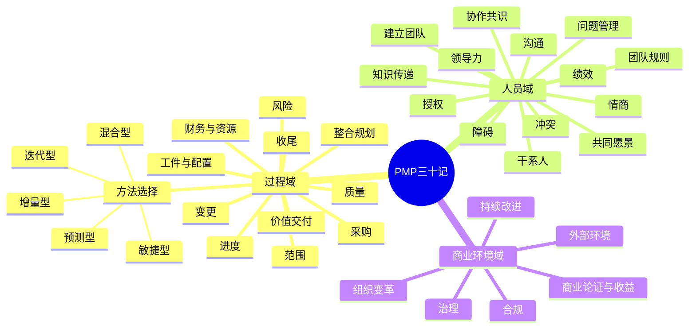

# PMP考前冲刺“三十记”：总览、知识地图与2026考试更新

## 一、这套资料真正要训练的能力

原始资料以“三十记”组织知识，并分别覆盖**任务、人员和商业环境**。其价值不在于背诵孤立术语，而在于训练一种统一的情境决策能力：

> **识别项目环境 → 判断事件性质 → 确定角色权限 → 先分析与协作 → 按治理流程行动 → 更新工件并形成反馈闭环。**

这也是PMP情境题最稳定的底层结构。题目通常不会直接问定义，而是给出一个“项目经理下一步/首先/本应做什么”的场景，要求考生选择最符合专业伦理、治理边界、价值导向和团队协作原则的行动。

> 可编辑矢量图：[PMP三十记知识地图 SVG](/donot-eat-fish/img/project-management/pmp-exam/pmp-thirty-notes-knowledge-map.svg)

## 二、2026年新版PMP考试必须注意的变化

原PDF形成于2025年7月，当时常用的考试权重为人员42%、过程50%、商业环境8%。PMI在2026年7月上线新版PMP考试后，权重调整为：

| 考试域 | 2026权重 | 学习重点 |
|---|---:|---|
| 人员 People | 33% | 共同愿景、冲突、领导团队、干系人参与与期望、知识传递、沟通 |
| 过程 Process | 41% | 整合计划、范围、价值交付、资源、采购、财务、质量、进度、状态评估、收尾 |
| 商业环境 Business Environment | 26% | 治理、合规、变更、障碍与问题、风险、持续改进、组织变革、外部环境 |

同时，题目大约有**40%预测型**，其余约**60%分布于敏捷和混合型**。因此，原资料的三十记仍然是高价值基础，但复习时不能再把商业环境当成“少量送分题”。

### 2026版与PMBOK第七、八版的关系

- **PMP考试大纲（ECO）**规定“考什么工作任务”；
- **PMBOK指南**提供原则、绩效域、过程、工具与实践基础；
- **考试题**要求把这些知识应用到具体工作场景，而不是机械背诵输入、工具和输出。

PMBOK第七版强调12项原则与8个绩效域；PMBOK第八版继续保留“原则+绩效域”的基础，同时将结构简化为6项核心原则和7个绩效域，并强化AI、PMO、采购、可持续性和实务过程指导。备考时应以**新版ECO任务**作为目录，以PMBOK和敏捷实践指南作为知识来源。

## 三、三十记与2026三大考试域的映射

### 1. 过程域

| 三十记 | 核心主题 | 高频输出/工具 |
|---:|---|---|
| 1 | 确定适当项目方法 | 预测、迭代、增量、敏捷、混合、裁剪 |
| 3 | 整合项目规划 | 项目管理计划、迭代规划、依赖整合 |
| 4 | 范围 | 需求、范围说明书、WBS、RTM、验收 |
| 5 | 进度 | 网络图、关键路径、估算、压缩、速率 |
| 6 | 预算与资源 | 成本基准、储备、EVM、资源优化 |
| 7 | 质量 | 质量计划、管理质量、控制质量、DoD |
| 9 | 风险 | 识别、分析、应对、储备、监督 |
| 10 | 采购 | 采购文件、合同类型、谈判、绩效审查 |
| 12 | 项目工件 | PMIS、配置管理、版本、可交付成果状态 |
| 13 | 紧急价值交付 | 待办列表、优先级、MVP、DoR/DoD |
| 16 | 变更 | 影响分析、审批、基准更新、沟通实施 |
| 17 | 收尾 | 验收、移交、结算、经验教训、归档 |

### 2. 人员域

| 三十记 | 核心主题 | 高频决策原则 |
|---:|---|---|
| 8 | 沟通 | 根据受众、信息量、反馈需要选择互动/推式/拉式 |
| 11 | 干系人参与 | 识别、分析、制定策略、持续调整参与水平 |
| 14 | 知识交流 | 培训、辅导、结对、知识库、经验教训 |
| 15 | 问题管理 | 已发生即问题，记录、分析、解决、必要时变更 |
| 18 | 基本规则 | 团队章程、会议规则、决策程序、行为准则 |
| 19 | 建立团队 | 获取资源、虚拟团队、文化差异、谈判 |
| 20 | 领导团队 | 服务型/情境型领导、心理安全、消除干扰 |
| 21 | 情商 | 先理解情绪与动机，再采取行动 |
| 22 | 授权 | 自组织、群体决策、团队负责“怎么做” |
| 23 | 支持绩效 | 反馈、激励、认可、团队建设、发展阶段 |
| 24 | 冲突 | 首选合作/解决问题，先私下处理，必要时升级 |
| 25 | 障碍 | 识别、排序、分析、移除、跟踪 |
| 26 | 协作共识 | 共享愿景、引导讨论、对齐目标和期望 |

### 3. 商业环境域

| 三十记 | 核心主题 | 高频决策原则 |
|---:|---|---|
| 2 | 治理 | 明确决策权、升级路径、报告机制、PMO/发起人作用 |
| 27 | 组织变革 | 评估文化、获得高层支持、试点、培训与反馈 |
| 28 | 收益与价值 | 商业论证、项目章程、收益管理计划、持续价值验证 |
| 29 | 合规 | 从规划开始嵌入，不把合规检查推迟到最终发布 |
| 30 | 外部环境 | 持续扫描法规、技术、市场、地缘及可持续性变化 |

## 四、总思维导图

## 五、PMP情境题八步决策算法

### 第一步：识别生命周期

- 有基准、CCB、详细计划、正式验收：通常是**预测型**；
- 有产品负责人、待办列表、迭代、站会、评审、回顾：通常是**敏捷型**；
- 软件持续迭代，但硬件、监管、供应商或阶段门固定：通常是**混合型**。

### 第二步：判断事件性质

| 关键词 | 判断 | 首要工件/流程 |
|---|---|---|
| 可能、也许、担心、预计 | 风险 | 风险登记册、风险分析与应对 |
| 已发生、已经延误、已经失败 | 问题 | 问题日志、根因分析、解决方案 |
| 请求新增/删除/修改范围、基准或合同 | 变更 | 变更请求、影响分析、审批流程 |
| 不合格、测试失败、缺陷 | 质量问题 | 缺陷修复；影响基准时提交变更 |

### 第三步：识别角色与权限

- **发起人**：授权项目、确保资金、维护商业可行性、处理超出项目经理权限的重大问题；
- **项目经理**：整合管理、促进协作、执行治理、分析影响；
- **产品负责人**：产品愿景、待办列表、价值排序、验收反馈；
- **敏捷教练/Scrum Master**：服务团队、消除障碍、保护团队、促进敏捷实践；
- **团队**：自主决定如何完成工作、估算、承诺、解决技术问题；
- **CCB/授权人**：审批影响基准的正式变更；
- **PMO**：方法、模板、审计、共享资源与组织级指导。

### 第四步：先分析，避免冲动行动

PMP高频正确答案通常包含：审查计划、核实事实、分析影响、与相关方讨论、识别根因。典型错误选项是：直接替换成员、立即扩大预算、直接改变范围、未经分析就升级。

### 第五步：优先协作和解决问题

除非涉及安全、违法、严重伦理或紧急不可逆风险，否则优先顺序通常是：

1. 了解事实和情绪；
2. 与当事人直接沟通；
3. 共同制定解决方案；
4. 必要时按照治理路径升级。

### 第六步：按计划和流程行动

计划不是为了限制响应，而是为了明确“谁、何时、以什么标准、通过什么权限”做决策。预测型通过变更控制保持基准完整；敏捷型通过待办列表重排和迭代反馈管理变化。

### 第七步：只在必要时升级

下列情况通常应升级：

- 超出项目经理权限或项目边界；
- 项目商业可行性、战略优先级或资金发生重大变化；
- 资源冲突涉及多个项目/项目集且无法协商；
- 风险应对责任位于项目外部；
- 法律、伦理、安全等重大问题。

### 第八步：闭环

实施后应更新计划、登记册、日志和状态报告，通知相关方，并将经验沉淀到经验教训登记册或组织过程资产中。

## 六、常见错误选项的“反向识别”

| 错误倾向 | 为什么通常不选 |
|---|---|
| 直接开始执行 | 未规划、未澄清范围或未获得共识，放大风险 |
| 直接提交变更 | 变更前通常需先分析影响；敏捷中先进入待办列表评估价值 |
| 立即找发起人 | 项目经理应先在权限范围内分析和协作 |
| 立即替换成员 | 应先沟通、辅导、绩效改进或确认能力缺口 |
| 忽视干系人意见 | 违背参与、期望管理和价值交付原则 |
| 为赶进度牺牲质量/合规 | 质量和合规应内建，不能以交付速度为由跳过 |
| 把敏捷理解为无计划 | 敏捷是分层、滚动式、价值驱动的规划，不是没有计划 |

## 七、冲刺复习路线

1. **理解**：先理解角色、流程和为什么；
2. **专题**：范围、风险、采购、敏捷等逐个突破；
3. **映射**：每道题定位到ECO任务和“三十记”；
4. **错题**：记录错误决策链，不只记正确字母；
5. **模拟**：训练230分钟内的节奏、耐力和不确定题处理；
6. **固化**：考前回看高频框架、易混概念和错题标签。

## 参考资料

1. 用户提供：《PMP考前冲刺——预测&适应型项目管理流程快速回顾》，75页，2025-07-03。
2. PMI, *PMP Examination Content Outline – July 2026*。
3. PMI, *PMBOK® Guide – Seventh Edition*。
4. PMI, *PMBOK® Guide – Eighth Edition*, 2025。
5. PMI & Agile Alliance, *Agile Practice Guide – Second Edition*, 2026。
